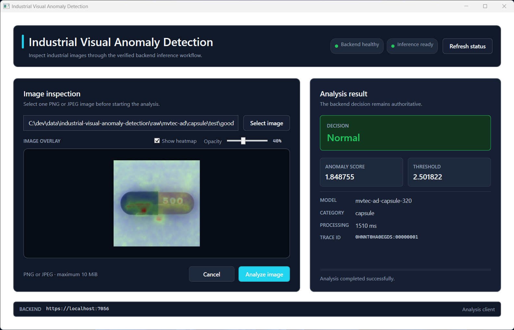
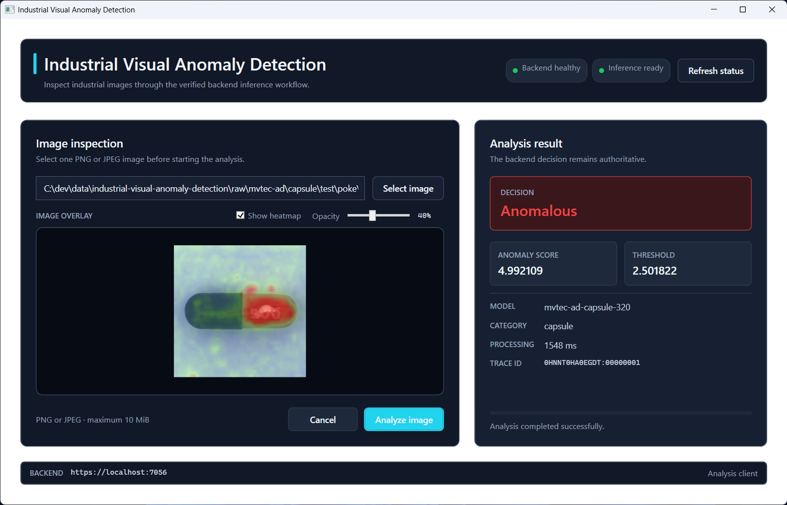

# Industrial Visual Anomaly Detection Desktop

[](https://github.com/rluetken-dev/industrial-visual-anomaly-detection-desktop/actions/workflows/ci.yml)
[](https://github.com/rluetken-dev/industrial-visual-anomaly-detection-desktop/releases/latest)
[](https://dotnet.microsoft.com/)
[](https://learn.microsoft.com/dotnet/desktop/wpf/)
[](https://www.microsoft.com/windows)

Windows desktop client for the Industrial Visual Anomaly Detection system, built with C#, .NET 10, WPF, and MVVM.

The application provides an operator-facing workflow for selecting an industrial image, previewing it locally, submitting it to the ASP.NET Core backend, inspecting the returned anomaly-detection result, and reviewing an interactive anomaly-heatmap overlay.

## Current Status

The desktop analysis workflow, including interactive heatmap visualization, is implemented and verified.

Available capabilities include:

- automatic and manual backend health checks;
- separate backend-liveness and inference-readiness indicators;
- local PNG and JPEG file selection;
- image preview without retaining an unnecessary source-file lock;
- multipart image analysis through the ASP.NET Core backend;
- cancellation of an active analysis request;
- busy state and duplicate-submission protection;
- normal and anomalous decision presentation;
- anomaly score and threshold display;
- model identifier, category, processing time, and trace identifier display;
- validated PNG heatmap response mapping;
- Base64 heatmap decoding into an immutable WPF image;
- aligned source-image and heatmap overlay;
- heatmap visibility control and adjustable opacity;
- user-facing timeout, connectivity, validation, and service-failure states;
- validated backend configuration;
- centralized WPF styling;
- 49 passing automated tests.

The Release solution builds successfully. Normal and anomalous capsule images have both been verified end to end through the WPF client, ASP.NET Core backend, Python inference service, and exported model artifact. The returned `320 x 320` PNG heatmaps were verified in the desktop overlay with a default opacity of 40 percent.

CI is configured and verified. Version `v0.1.0` records the initial desktop analysis workflow. The heatmap-overlay milestone is implemented on `main` and is intended for the next release. See [Development Status](docs/DevelopmentStatus.md) for the detailed verified state.

## Screenshots

### Normal analysis with heatmap overlay



### Anomalous analysis with heatmap overlay



## Application Workflow

1. Start the Python inference service.
2. Start the ASP.NET Core backend.
3. Start the WPF desktop application.
4. Confirm that backend liveness and inference readiness are green.
5. Select a local PNG or JPEG image.
6. Inspect the local image preview.
7. Start the analysis.
8. Inspect the backend decision and supporting result values.
9. Review the aligned anomaly-heatmap overlay.
10. Toggle the heatmap or adjust its opacity when comparing it with the source image.

The application performs an initial status refresh after startup. A manual **Refresh status** action is also available.

## System Context

```text
WPF desktop application
        |
        | HTTPS, multipart form data and JSON
        | Receives decision data and Base64 PNG heatmap
        v
ASP.NET Core backend
        |
        | HTTP
        v
Python inference service
        |
        v
Exported anomaly-detection model artifact
```

The desktop application communicates only with the ASP.NET Core backend. It does not invoke Python directly, load model artifacts, or access raw model tensors.

## Technology Stack

- C# and .NET 10;
- WPF;
- MVVM with `CommunityToolkit.Mvvm`;
- .NET Generic Host;
- dependency injection and validated options;
- typed clients through `IHttpClientFactory`;
- `System.Text.Json`;
- xUnit.

## Prerequisites

- Windows;
- [.NET 10 SDK](https://dotnet.microsoft.com/download/dotnet/10.0);
- Visual Studio with the **.NET desktop development** workload, or another environment capable of building WPF projects;
- Git;
- a running copy of the related Python inference service;
- a running copy of the related ASP.NET Core backend.

The model service requires an exported model artifact. Follow the model repository instructions to create or configure that artifact before starting the full stack.

## Related Repositories

- [Industrial Visual Anomaly Detection Model](https://github.com/rluetken-dev/industrial-visual-anomaly-detection-model)
- [Industrial Visual Anomaly Detection Backend](https://github.com/rluetken-dev/industrial-visual-anomaly-detection-backend)

Clone all three repositories into separate directories. The desktop repository does not contain datasets, model artifacts, or the backend runtime.

## Repository Structure

```text
industrial-visual-anomaly-detection-desktop/
|-- src/
|   `-- IndustrialVisualAnomalyDetection.Desktop/
|       |-- Configuration/
|       |-- Models/
|       |-- Resources/
|       |   `-- Styles/
|       |-- Services/
|       |-- ViewModels/
|       |-- Views/
|       |-- App.xaml
|       |-- App.xaml.cs
|       `-- appsettings.json
|-- tests/
|   `-- IndustrialVisualAnomalyDetection.Desktop.Tests/
|-- docs/
|   |-- screenshots/
|   |   |-- analysis-anomalous.png
|   |   `-- analysis-normal.png
|   |-- ApiIntegration.md
|   |-- ArchitectureOverview.md
|   |-- DevelopmentStatus.md
|   `-- ProjectSpecification.md
|-- .github/
|   `-- workflows/
|       `-- ci.yml
|-- .editorconfig
|-- .gitattributes
|-- .gitignore
|-- COMMITS.md
|-- README.md
`-- IndustrialVisualAnomalyDetection.Desktop.slnx
```

## Restore and Build

From the desktop repository root:

```powershell
dotnet restore .\IndustrialVisualAnomalyDetection.Desktop.slnx

dotnet build .\IndustrialVisualAnomalyDetection.Desktop.slnx
```

For the verified Release build:

```powershell
dotnet build .\IndustrialVisualAnomalyDetection.Desktop.slnx `
    --configuration Release
```

## Run the Complete Local Stack

The three processes must run simultaneously. Use a separate terminal or Visual Studio instance for each long-running component.

### 1. Start the Python inference service

From the model repository root, configure the exported artifact and start Uvicorn:

```powershell
$env:IVAD_MODEL_ARTIFACT = "$PWD\outputs\model-artifacts\mvtec-ad-capsule-320"
$env:IVAD_MEMORY_CHUNK_SIZE = "4096"

.\.venv\Scripts\python.exe -m uvicorn `
    industrial_visual_anomaly_detection.service.app:app `
    --host 127.0.0.1 `
    --port 8000
```

Verify the service in another terminal:

```powershell
curl.exe http://127.0.0.1:8000/health/live
```

Expected response:

```json
{"status":"healthy"}
```

### 2. Start the ASP.NET Core backend

From the backend repository root, run the API project:

```powershell
dotnet run `
    --project .\src\IndustrialVisualAnomalyDetection.Api\IndustrialVisualAnomalyDetection.Api.csproj
```

For first-time local HTTPS setup, trust the development certificate:

```powershell
dotnet dev-certs https --trust
```

Verify backend readiness:

```powershell
curl.exe --insecure https://localhost:7056/health/ready
```

Expected response when both backend and inference service are ready:

```json
{"status":"ready"}
```

### 3. Start the WPF desktop application

From the desktop repository root, run the application from Visual Studio or execute:

```powershell
dotnet run `
    --project .\src\IndustrialVisualAnomalyDetection.Desktop\IndustrialVisualAnomalyDetection.Desktop.csproj
```

The application checks the backend automatically after startup. Both status indicators should become green when the complete stack is available.

## Configuration

Desktop backend settings are stored in:

`src/IndustrialVisualAnomalyDetection.Desktop/appsettings.json`

The default local configuration uses:

```json
{
  "Backend": {
    "BaseAddress": "https://localhost:7056",
    "TimeoutSeconds": 30
  }
}
```

The base address must be an absolute HTTP or HTTPS URI, and the timeout must be greater than zero. Configuration is validated during application startup.

Do not commit private hostnames, credentials, personal paths, or machine-specific local overrides.

## Test

After a successful build:

```powershell
dotnet test .\IndustrialVisualAnomalyDetection.Desktop.slnx `
    --no-build
```

Run the verified Release test sequence with:

```powershell
dotnet build .\IndustrialVisualAnomalyDetection.Desktop.slnx `
    --configuration Release

dotnet test .\IndustrialVisualAnomalyDetection.Desktop.slnx `
    --configuration Release `
    --no-build
```

The current suite contains 49 tests covering:

- backend configuration validation;
- backend liveness and readiness mapping;
- HTTP timeout and unavailable states;
- multipart analysis requests;
- normal and anomalous response mapping;
- required heatmap-contract mapping;
- heatmap model invariants and Base64 validation;
- PNG decoding into immutable WPF image sources;
- invalid response handling;
- view-model health, analysis, and heatmap state transitions;
- command availability and cancellation.

## Backend Integration

The desktop client consumes:

- `GET /health/live`;
- `GET /health/ready`;
- `POST /api/v1/analyses`.

Image analysis uses multipart form data with the field name `image`. The backend response supplies the authoritative decision together with score, threshold, model information, processing time, trace identifier, and a required `image/png` heatmap encoded as Base64.

The desktop client validates the heatmap metadata, decodes the PNG into an immutable WPF image, and overlays it on the source preview. Heatmap visibility and opacity are presentation-only controls and do not change the backend decision or anomaly score.

See [API Integration](docs/ApiIntegration.md) for the complete consumed contract and verified behavior.

## Verified Results

The full local stack has been verified with the exported `mvtec-ad-capsule-320` artifact:

| Image | Score | Threshold | Decision | Heatmap |
| --- | ---: | ---: | --- | --- |
| Capsule `test/good/000.png` | `1.848755` | `2.501822` | Normal | `320 x 320` PNG overlay |
| Capsule `test/poke/000.png` | `4.992109` | `2.501822` | Anomalous | `320 x 320` PNG overlay |

These examples verify desktop integration, heatmap transport, decoding, alignment, and presentation. They are not a new model benchmark. A heatmap visualizes relative patch responses and must not be interpreted as a certified defect-segmentation mask.

## Deferred Scope

The following capabilities remain intentionally deferred:

- certified defect segmentation or pixel-accurate masks;
- generalized overlay alignment for preprocessing pipelines that crop or change aspect ratio;
- analysis history and persistence;
- batch image processing;
- camera integration;
- drag-and-drop upload;
- authentication;
- installer packaging and automatic updates.

The desktop client will continue to consume visualization output through the backend contract. It will not access model tensors or artifacts directly.

## Documentation

- [Project Specification](docs/ProjectSpecification.md)
- [Architecture Overview](docs/ArchitectureOverview.md)
- [Development Status](docs/DevelopmentStatus.md)
- [API Integration](docs/ApiIntegration.md)
- [Commit Message Guidelines](COMMITS.md)

Documentation is updated after verified milestones or meaningful groups of changes rather than after every small internal edit.

## Data and Artifacts

This repository must not contain:

- MVTec datasets;
- raw uploaded industrial images;
- model artifacts;
- standalone generated heatmaps or raw analysis output;
- local logs;
- machine-specific configuration;
- credentials or secrets.

Documented application screenshots under `docs/screenshots` are the intentional exception for portfolio presentation. They show the user interface and verified workflow rather than distributing source datasets or reusable model artifacts.

## License

No license has been selected yet. Until a license is added, normal copyright restrictions apply.
